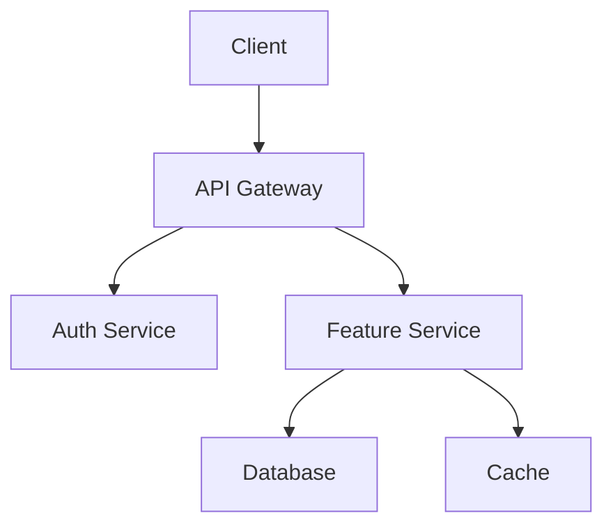

# Design Documentation

Create technical blueprints that bridge requirements and implementation. This skill teaches how to document architecture decisions, component design, and system interactions.

## When to Use This Skill

Use design documentation when:
- Requirements phase is complete and approved
- You need to plan technical implementation
- Multiple developers will work on the feature
- Architecture decisions need documentation
- The feature involves complex integrations

## Design Document Structure

### Standard Template

```markdown
# Design Document: [Feature Name]

## Overview
[High-level summary of the feature and approach]

## Architecture
[System architecture and component overview]

## Components and Interfaces
[Detailed component descriptions and interactions]

## Data Models
[Data structures and relationships]

## Error Handling
[Error scenarios and response strategies]

## Testing Strategy
[Testing approach and quality assurance]
```

## Step-by-Step Process

### Step 1: Requirements Analysis

Before designing, ensure you understand:
- All functional requirements
- Non-functional requirements (performance, security, scalability)
- Constraints (technology stack, timeline, resources)
- Integration points with existing systems

**Analysis Questions:**
- What does the system need to do?
- What are the performance expectations?
- What existing code/systems does this touch?
- What are the security requirements?
- What could go wrong?

### Step 2: Research and Context Building

Identify areas needing research:
- Technology choices and alternatives
- Third-party integrations and APIs
- Best practices for similar systems
- Security and compliance considerations

**Research Documentation:**
```markdown
## Research Findings

### [Topic]
**Sources:** [Links/references]
**Key Insights:**
- [Finding 1]
- [Finding 2]
**Impact on Design:** [How this affects our approach]
```

### Step 3: Define System Architecture

Document the high-level structure:

```markdown
## Architecture

### System Overview
[How the overall system works]

### Component Architecture
[Major components and their responsibilities]

### Data Flow
[How information moves through the system]

### Technology Decisions
[Key technology choices and rationale]
```

**Architecture Diagram (Mermaid):**


### Step 4: Design Components and Interfaces

For each major component:

```markdown
## Components and Interfaces

### [Component Name]
**Purpose:** [What this component does]

**Responsibilities:**
- [Responsibility 1]
- [Responsibility 2]

**Interfaces:**
- Input: [What it receives]
- Output: [What it produces]
- Dependencies: [What it requires]

**API Definition:**
```typescript
interface ComponentName {
  method(input: InputType): Promise<OutputType>;
}
```
```

### Step 5: Define Data Models

Document all data structures:

```markdown
## Data Models

### [Entity Name]
**Purpose:** [What this entity represents]

**Properties:**
| Field | Type | Required | Description |
|-------|------|----------|-------------|
| id | string | Yes | Unique identifier |
| name | string | Yes | Display name |
| createdAt | Date | Yes | Creation timestamp |

**Validation Rules:**
- [Rule 1]
- [Rule 2]

**Relationships:**
- [Relationship to other entities]

**Example:**
```json
{
  "id": "abc123",
  "name": "Example",
  "createdAt": "2024-01-15T10:30:00Z"
}
```
```

### Step 6: Plan Error Handling

Document error scenarios:

```markdown
## Error Handling

### Error Categories
1. **Validation Errors:** Invalid user input
2. **Authentication Errors:** Unauthorized access
3. **External Service Errors:** Third-party failures
4. **System Errors:** Internal failures

### Error Response Strategy

| Error Type | HTTP Code | User Message | System Action |
|------------|-----------|--------------|---------------|
| Validation | 400 | Specific field error | Log, return details |
| Auth | 401 | "Please log in" | Redirect to login |
| Not Found | 404 | "Resource not found" | Log, return error |
| Server | 500 | "Something went wrong" | Log, alert, retry |

### Recovery Mechanisms
- [Retry strategies]
- [Fallback behaviors]
- [Circuit breaker patterns]
```

### Step 7: Define Testing Strategy

```markdown
## Testing Strategy

### Unit Testing
- **Coverage Target:** 80%+
- **Focus Areas:** [Critical business logic]
- **Mocking Strategy:** [What to mock]

### Integration Testing
- **Scope:** [Component interactions to test]
- **Environment:** [Test environment setup]
- **Data Strategy:** [Test data approach]

### End-to-End Testing
- **Critical Paths:** [User journeys to test]
- **Tools:** [Testing tools]

### Performance Testing
- **Load Targets:** [Expected load]
- **Benchmarks:** [Performance requirements]
```

## Decision Documentation

Document key decisions using this template:

```markdown
### Decision: [Brief Title]

**Context:** [Situation requiring a decision]

**Options Considered:**

**Option 1: [Name]**
- Pros: [Benefits]
- Cons: [Drawbacks]
- Effort: [Low/Medium/High]

**Option 2: [Name]**
- Pros: [Benefits]
- Cons: [Drawbacks]
- Effort: [Low/Medium/High]

**Decision:** [Chosen option]

**Rationale:** [Why this option was selected]

**Implications:** [What this means for implementation]
```

## Common Design Decisions

### API Design
```markdown
### Decision: API Architecture

**Options:**
1. **REST API** - Standard HTTP methods, well-understood
2. **GraphQL** - Flexible queries, single endpoint
3. **RPC-style** - Direct operation mapping

**Decision:** REST API
**Rationale:** Standard CRUD operations, team familiarity, good tooling support
```

### Data Storage
```markdown
### Decision: Database Choice

**Options:**
1. **PostgreSQL** - ACID compliance, complex queries
2. **MongoDB** - Schema flexibility, horizontal scaling
3. **Redis** - High performance, limited queries

**Decision:** PostgreSQL with JSON columns
**Rationale:** Data consistency needs + flexibility for user preferences
```

### Authentication
```markdown
### Decision: Authentication Strategy

**Options:**
1. **Session-based** - Server-controlled, simple
2. **JWT tokens** - Stateless, scalable
3. **OAuth 2.0** - External provider, no password management

**Decision:** JWT with refresh token rotation
**Rationale:** Scalability requirements, API-first architecture
```

## Quality Checklist

Before finalizing design:

**Completeness:**
- [ ] All requirements addressed in design
- [ ] Major system components defined
- [ ] Data models cover all entities
- [ ] Error handling covers expected failures
- [ ] Testing strategy addresses all layers

**Clarity:**
- [ ] Design decisions clearly explained
- [ ] Component responsibilities well-defined
- [ ] Interfaces between components specified
- [ ] Technical choices include rationale

**Feasibility:**
- [ ] Design is technically achievable
- [ ] Performance requirements can be met
- [ ] Security requirements addressed
- [ ] Implementation complexity reasonable

**Traceability:**
- [ ] Design elements map to requirements
- [ ] All requirements covered by design
- [ ] Testing validates requirement fulfillment

## Common Pitfalls

1. **Over-Engineering:** Design for current requirements, not hypothetical futures
2. **Under-Specified Interfaces:** Define clear component boundaries
3. **Ignoring Non-Functional Requirements:** Address performance, security, scalability
4. **Technology-First Design:** Let requirements drive technology choices
5. **Insufficient Error Handling:** Plan for failures, not just happy paths

## Example: User Profile Design

```markdown
# Design Document: User Profile Management

## Overview
Enable users to view and edit their profile information, including personal details, preferences, and profile picture.

## Architecture

### Component Architecture
```
┌─────────────┐     ┌──────────────┐     ┌─────────────┐
│   Client    │────▶│  Profile API │────▶│  Database   │
└─────────────┘     └──────────────┘     └─────────────┘
                           │
                           ▼
                    ┌──────────────┐
                    │ Image Store  │
                    └──────────────┘
```

### Technology Stack
- API: Node.js with Express
- Database: PostgreSQL
- Image Storage: S3-compatible object storage
- Cache: Redis for session data

## Components

### ProfileService
**Purpose:** Manage user profile CRUD operations

**Interface:**
```typescript
interface ProfileService {
  getProfile(userId: string): Promise<UserProfile>;
  updateProfile(userId: string, data: ProfileUpdate): Promise<UserProfile>;
  uploadAvatar(userId: string, image: File): Promise<string>;
  deleteAvatar(userId: string): Promise<void>;
}
```

## Data Models

### UserProfile
| Field | Type | Required | Validation |
|-------|------|----------|------------|
| id | UUID | Yes | Auto-generated |
| email | string | Yes | Valid email format |
| displayName | string | Yes | 2-50 characters |
| bio | string | No | Max 500 characters |
| avatarUrl | string | No | Valid URL |
| preferences | JSON | No | Valid JSON object |
| updatedAt | timestamp | Yes | Auto-updated |

## Error Handling

| Scenario | Response | Action |
|----------|----------|--------|
| Profile not found | 404 | Return error message |
| Invalid update data | 400 | Return validation errors |
| Image too large | 413 | Return size limit error |
| Unauthorized | 401 | Redirect to login |

## Testing Strategy
- Unit tests for validation logic
- Integration tests for API endpoints
- E2E test for profile edit flow
```

## Next Steps

After completing design:
1. Get design review and approval
2. Move to Task Planning phase
3. Break design into implementation tasks
4. Begin systematic implementation
